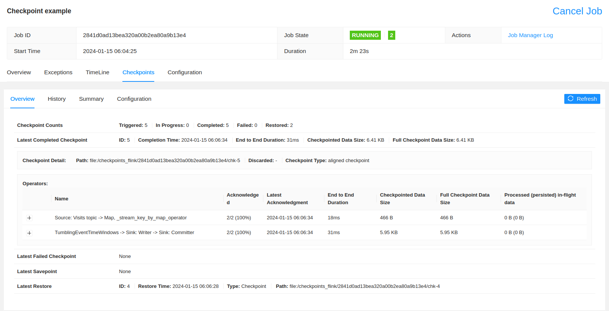
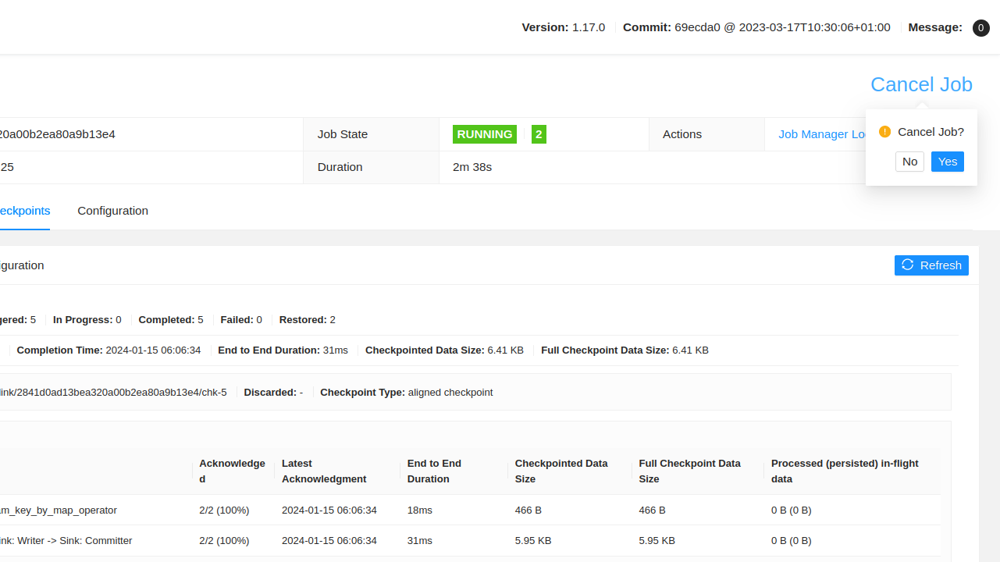

# Fault-tolerance - Apache Flink

1. Explain the [stateful_flink_consumer.py](stateful_flink_consumer.py)
* even though it looks like a simple stateful job, there are several points to keep in mind here:
  * `state.checkpoints.dir` attribute that defines where the state gets checkpointed for fault-tolerance
    * it's passed in the Docker Compose: `-Dstate.checkpoints.dir="file:///checkpoints_flink"`
  * `enable_externalized_checkpoints` that keeps the checkpoint files even after the job cancellation
  * `env.enable_checkpointing(checkpoint_interval_20_seconds, mode=checkpoint_mode)` that impacts the state checkpointing


In the demo we're going to configure the job either with the exactly-once checkpoint. Below some explanation from the [documentation](https://nightlies.apache.org/flink/flink-docs-release-1.17/docs/dev/datastream/fault-tolerance/checkpointing/)
> exactly-once vs. at-least-once: You can optionally pass a mode to the enableCheckpointing(n) method to choose between the two guarantee levels. Exactly-once is preferable for most applications. At-least-once may be relevant for certain super-low-latency (consistently few milliseconds) applications.

Therefore, this mode is important for the state consistency because it, according to the Javadoc:
>     /**
>     * Sets the checkpointing mode to "exactly once". This mode means that the system will
>     * checkpoint the operator and user function state in such a way that, upon recovery, every
>     * record will be reflected exactly once in the operator state.
>     *
>     * <p>For example, if a user function counts the number of elements in a stream, this number
>     * will consistently be equal to the number of actual elements in the stream, regardless of
>     * failures and recovery.

The AT_LEAST_ONCE semantic is different because it provides weaker state consistency:
>     /**
>     * Sets the checkpointing mode to "at least once". This mode means that the system will
>     * checkpoint the operator and user function state in a simpler way. Upon failure and recovery,
>     * some records may be reflected multiple times in the operator state.
>     *
>     * <p>For example, if a user function counts the number of elements in a stream, this number
>     * will equal to, or larger, than the actual number of elements in the stream, in the presence
>     * of failure and recovery.
>     *


3. Explain the Docker setup:
```
less docker/docker-compose.yaml
```
Checkpoint restore doesn't work in the local IDE-based Flink. That's why we rely here on the containerized version.
As you can see, the Job Manager starts our stateful job with mounted volumes for artifacts (JAR) and external 
checkpoint storage (/checkpoints).

Besides, the data generator will generate a small number of rows to easily spot the checkpoint differences.

You might need to change permissions of the `docker/checkpoints` to 777 for the sake of simplicity in this demo.

4. Start the containers 
```
cd docker
docker-compose down --volumes; docker-compose up
```
5. Connect to the JobManager and submit the job:
```
docker exec -ti docker_jobmanager_1 bash
./bin/flink run -pyclientexec /usr/bin/python3 -pyexec /usr/bin/python3 -pyfs /opt/flink/usrlib/ \
  -py /opt/flink/usrlib/stateful_flink_consumer.py -Dstate.checkpoints.dir="file:///checkpoints_flink"
```
Remember the job id printed in the response of the command:
```
Job has been submitted with JobID 9b68282065d8fa061d7233f66058dd56
```
6. Open the Kafka console consumer:
```
docker exec -ti dedp_ch03_fault_tolerance_kafka kafka-console-consumer.sh --bootstrap-server localhost:9092  --topic visit_windows --from-beginning
```
7. Go to Flink UI http://localhost:8081 and check if the job is running.

8. A few seconds after performing at least the 2nd checkpoint, stop the job 

9. Go to the Kafka console and remember the last processed entries
10. Restart the job from the JobManager.
```
# 9b68282065d8fa061d7233f66058dd56 is the job id
ls /checkpoints_flink/9b68282065d8fa061d7233f66058dd56
# export here your checkpoint file from the most recent checkpoint
export CHECKPOINT_FILE=/checkpoints_flink/9b68282065d8fa061d7233f66058dd56/chk-2
./bin/flink run -pyclientexec /usr/bin/python3 -pyexec /usr/bin/python3 -pyfs /opt/flink/usrlib/ \
  -py /opt/flink/usrlib/stateful_flink_consumer.py -s file://$CHECKPOINT_FILE -Dstate.checkpoints.dir="file:///checkpoints_flink"
```

11. Go to the Kafka console. You should windows generated from the most recent offset and not from the beginning as
configured in the job (`.set_starting_offsets(KafkaOffsetsInitializer.earliest())`).